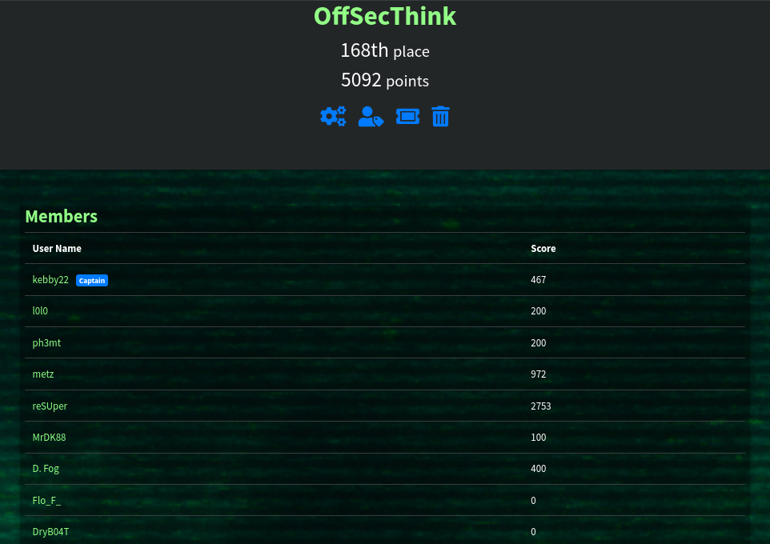
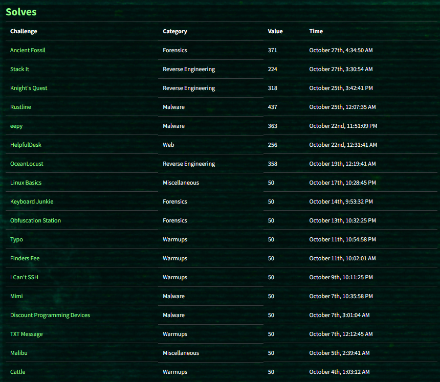

## Graphs 
<!DOCTYPE html>
<html lang="en">
<head>
    <meta charset="UTF-8">
    <meta name="viewport" content="width=device-width, initial-scale=1.0">
    
</head>
<body>
  

       
  

    

        
        
    

</body>
</html>

--- 
## Summary

- User: **reSUper**  Score: **2753 points**
- Team: **OffsecThink**  Total Score: **5092 points** 
- Placement:  **168 / 3447 th**



---
## Solves
List of Challenges solved. 

| Challenges          | Categories             
| ---------           | --------             
  [Stack it](stackit)            | Reverse Engeneering
  [Knight's Quest](knightsquest)     | Reverse Engeneering
  [Ocean Locust](oceanlocust)        | Reverse Egeneering
  [Rustline](rustline)            | Malware 
  [Eepy](eepy)                | Malware
  [Mimi](mimi)                | Malware
  [Discount Programming Device](discountProgrammingDevice)| Malware
| [Ancient Fossil](ancientfossil)      | Forensics             
  [Keyboard Junkie](keyboardjunky)     | Forensics
  [Obfuscation Station](obfuscationstation) | Forensics
  [HelpfulDesk](helpfuldesk)         | Web 
  [Linux Basics](linuxbasics)        | Miscellaneous
  [Malibu](malibu)             | Miscellaneous
  [Typo](typo)                | Warmups
  [Finders Fee](finderfee)         | Warmups
  [I Can't SSH](icantSSH)         | Warmups
  [TXT Message](txtmessage)         | Warmups
  [Cattle](cattle)              | Warmups
---

## Writeups

